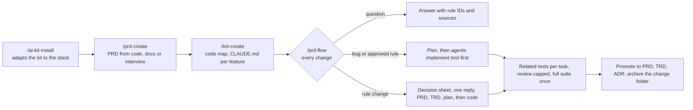

# AI Starter Kit

[](https://github.com/mtperessoni/ai-starter-kit/actions/workflows/ci.yml)

**Make any repository AI-driven in one command.** The kit installs a PRD and TRD that act as the single source of truth for product behavior, a gate that sends every change through them, subagents that work in parallel cheaply and talk through files, tests that run only for what changed, and a code structure an agent can navigate without reading whole files. It adapts itself to the project's stack.

Every rule here was built, measured and corrected in a production AI service, then extracted so new projects start where that one ended.

## Why

AI agents in a real codebase fail in predictable ways: they read whole files to find one rule, they rediscover the domain on every task, they implement from the code instead of from a decision, they run the whole test suite after every edit and then spend hours fixing tests unrelated to their change, and review loops never end.

What the rules in this kit changed, measured in the source repository:

| Change | Result |
|---|---|
| Orchestrator conducts, workers write files, the orchestrator reads only their short returns | End-to-end time -48%, cost -53%, main context peak from 196k to 76k tokens, same quality |
| PRD split into one small file per section, with an index, instead of two files of 64k and 165k characters | An agent loads the one rule it needs |
| Related tests only while working, the full suite once at the end against a baseline | Tasks that took 13 to 14 minutes because each ran the full suite stopped doing it |
| Code restructured by feature, size limits enforced by a ratchet | Modules over 500 lines from 18 to 1; a 4,056-line class became 23 collaborators |
| Review capped at 5 rounds, re-review scoped to the previous findings | The loop that had consumed 3.6 of 8.8 agent hours in one delivery stopped |

## How it works



Every fact has one living home, and everything else cites it by ID. A change gets a folder `changes/NNN-<slug>/` sized by risk; it holds intent, plan and state, never truth. At the end what is durable is promoted to its living home and the folder moves to `changes/archive/`.

| Size | When | Folder holds |
|---|---|---|
| S | Bug, approved rule, stale PRD, refactor | Nothing, or only `plan.md` |
| M | Rule change with an evident design | `brief.md` (why, scope, slices, success criteria as rule IDs) and `plan.md` |
| L | Rule change with a new data model, contract, integration, technical unknown or feature area | `brief.md`, `design.md` and `plan.md` |

| Fact | Living home |
|---|---|
| Behavior, edge cases, targets | `docs/prd/` |
| Code structure, invariants | `docs/trd/` |
| Structural decision | `docs/adr/` |
| Data model, API contract | The real artifact, linked from the TRD |
| Principles | `.specify/memory/constitution.md` |

Order of authority: constitution, PRD, TRD, code. An active plan governs only the order of work. `gate.py --trace`, `--change` and `--final` check that every rule has a test, every brief cites real rules, and nothing half-promoted reaches the base branch. Newer flags: `--rules --applied` (approved rows are in the PRD word for word), `--trd` (paths and symbols the TRD cites exist, TRD size budget), `--status` (state of every rule), `--sibling` (a PRD shared with another repository is identical). The decision sheet (`--sheet`, S0 to S6) and the answers record (Q3) are checked by the gate, and `scripts/gates.sh trailers` checks that commits cite the rules they implement.

| Skill | What it does |
|---|---|
| `/ai-kit` | Global. `install` detects the stack, copies and adapts the kit, configures the linter with a day-one baseline, verifies every command by running it. `update` brings kit improvements without overwriting the project's edits. `doctor` reports drift |
| `/prd-create` | Writes the PRDs: one folder per independent flow, one small file per section, rule rows with source and change via, glossary with code names, journey, configuration, risks, open questions; markdown only |
| `/trd-create` | Writes the technical map in any layout: one file per product area, invariants with their proof, the testing guide, the end-to-end flow, and a `CLAUDE.md` of at most 20 lines in every feature folder or declared map folder. In an existing codebase it writes the incremental readiness plan, and offers the move to feature folders as an option |
| `/prd-flow` | The gate for every change (formerly prd-gate). Classifies the request, loads only the rule and the map it needs, checks the doc against the code, and for a rule change runs survey, one decision sheet answered in the chat (one follow-up at most), PRD (confirmed by the person), TRD, plan, then subagents implement. A behavior found missing during execution goes back through a short rule change before code |
| `/adr` | Records architecture decisions with at least two honest negatives and two real alternatives |
| `/docs-html` | Rebuilds the human reading pages of the PRD and the TRD from the markdown and checks them. The only skill that touches HTML: the change flow never waits on it |

## Quick start

Requirements: [Claude Code](https://claude.com/claude-code), git, Python 3.10 or later (for the kit's scripts, whatever the project's stack), bash (Git Bash on Windows).

```bash
# 1. Once per machine
git clone https://github.com/mtperessoni/ai-starter-kit.git
cd ai-starter-kit
./install.sh            # Windows PowerShell: ./install.ps1
```

```text
# 2. In each project, inside Claude Code
/ai-kit install         # detects the stack, shows the plan, adapts, verifies, commits on a branch
/prd-create             # the PRD, from the code (or by interview in a new project)
/trd-create             # the code map and the feature CLAUDE.md files
/docs-html              # the PRD and TRD reading pages, whenever people want them

# 3. From then on
/prd-flow <any change or question about behavior>
```

To bring kit improvements into a project later: `git pull` in the kit, `./install.sh` again, then `/ai-kit update` in the project.

## What lands in a project

```
CLAUDE.md                       constitution index, the gate rule, code structure summary
AGENTS.md                       commands, critical constraints, finding things, handing work to subagents
ai-kit.json                     stack commands, structure limits
ai-kit.allowlist.json           ratchet allowlist (shrink-only)
.ai-kit/manifest.json           kit version and the files it owns
.specify/memory/constitution.md binding principles: the project's own plus the kit's process principles
.claude/skills/                 prd-create, trd-create, prd-flow (with repo.md, the project adapter), adr, docs-html
.claude/agents/                 the prd-flow roles (surveyor, docs, executor, reviewer, recheck) as defined
                                subagents, plus one findings-only reviewer per risk class of the domain
docs/prd/                       INDEX.md, README.md, CHANGELOG.md, prd.html (generated), one folder per PRD
.github/CODEOWNERS              PRD files owned by the rule owners listed in repo.md
docs/trd/                       README.md, one file per feature, infra.md, invariants.md, testing.md, trd.html (generated)
docs/code-structure.md          AR01 to AR28: where and how code lives, and this repository's layout
docs/ai-readiness.md            the readiness checklist by category, used by trd-create and doctor
docs/flow.md, docs/adr/         the one end-to-end diagram; decision records
changes/, changes/archive/      change folders in flight (brief, design, plan) and the finished ones
docs/templates/                 PRD section, TRD feature, feature CLAUDE.md, HTML shell, reviewer agent
scripts/                        gates.sh (including `close`, `verify`, `baseline`: suite, lint, trailers, final gate, retro), ratchet.py, related_tests.py,
                                new_failures.py, move_lines.py, hotspots.py, contract_drift.py, close_gate.py, baseline.py, verify.py,
                                config_get.py, kit_config.py, commit_trailers.py, clean_task_outputs.py, docker_hygiene.py,
                                guard_hook.py, reap.py, next_change_number.py, settings_check.py,
                                telemetry_hook.py, run_probe.py, retro.py, retro_detectors.py (gate_scope.py and state_record.py ship in the prd-flow skill)
.claude/settings.json           the telemetry hooks and the gate permissions, merged into the project's own;
                                reads of generated and vendored paths denied
.ignore                         generated and vendored paths kept out of search
.ai-kit/runs/                   run telemetry (git-ignored)
.github/workflows/              CI and the automated Claude review on every pull request
.gitattributes, .gitleaks.toml  LF everywhere; secret scan
```

## Run telemetry
Hooks record every tool call, subagent, compaction and wait of a run in `.ai-kit/runs/<change>/` (git-ignored), and `scripts/gates.sh` adds the time, memory and disk of each test and build. Outputs are never stored and secrets are redacted. At the end of a delivery `scripts/gates.sh retro` writes `retro.md`: findings only for what passed a threshold of `ai-kit.json` `telemetry` (slow calls, heavy subagents, loops, big outputs, memory, disk), none when the run stayed within all of them. The final report lists them. Rules: [rules/11-telemetry.md](rules/11-telemetry.md).

## Run speed
Lessons of a 432 minute run ([LS31](rules/09-lessons.md)) and of the interview that cost more than the code ([LS32](rules/09-lessons.md)). `scripts/gates.sh baseline <slug>` (run by the chief as a background Bash) records the failures once per plan commit, in a worktree; `scripts/gates.sh red <test>` proves a test fails first; `scripts/gates.sh docs <slug>` runs every docs check in one cached call. Verification is per batch: executors run only their own new test, and the chief runs one `scripts/gates.sh verify <slug>` per wave (TS53); gates are reminders run once per phase. A blocking guard hook (`scripts/guard_hook.py`) registered in `settings.json` runs for every subagent and never for the main thread: it denies heredocs, stdin interpreters, `taskkill`, `git stash`, `reset` and `checkout`, and each deny names the allowed way (Edit and Write, `gates.sh move`, `gates.sh reap`, commit with `-F <file>`). `scripts/gates.sh reap` kills leftover processes of the session by tree, and `verify` prints `stuck agents` from the watchdog. The chief never polls: dispatches run in the background, and the retro flags polling loops and processes left alive. prd-flow lite ([LS33](rules/09-lessons.md)) adds `gates.sh cleanup` and `gates.sh watch`. Rules: TS43 to TS54, SA48 to SA59, WF65 to WF83 in [rules/](rules/README.md); the prompt contract is `kit/.claude/skills/prd-flow/reference/dispatch.md`.

## The rules, in short

The full catalog, with the reason for each rule and the file that enforces it, is in [rules/](rules/README.md).

| Area | The rule that matters most |
|---|---|
| Source of truth | Behavior lives in the PRD as rule rows with permanent IDs; a rule change goes PRD, TRD, plan, code, after the person asking sees the current rule and confirms ([WF](rules/07-workflow.md)) |
| Lazy loading | Small files, an index, maps by symbol name; agents read the markdown one section at a time and never the HTML ([CE](rules/01-context-economy.md)) |
| Subagents | Defined agents dispatched with a task card; outputs written to a state folder; returns of at most 20 or 30 lines; no nested subagents; ceilings of calls and minutes ([SA](rules/02-subagents.md)) |
| Tests | Test first; only the mirror test and the importers of what changed while working; the full suite once at the end against a baseline, so agents never chase failures they did not cause ([TS](rules/04-testing.md)) |
| Review | At most 5 rounds per delivery, scoped re-review, stop and ask on an open Critical ([RV](rules/03-review.md)) |
| Structure | Feature folders recommended, any layout declared and accepted; in every layout: size and complexity limits, one responsibility per file, unique descriptive names, the PRD ID in every module and test, a `CLAUDE.md` map where the agent works, no runtime-built dispatch, no dead code, enforced by a shrink-only ratchet ([AR](rules/05-code-structure.md)) |
| Readiness | Incremental in the current layout: hotspots first, characterization tests before touching untested code, extract on touch, search noise excluded, schema snapshots, a time budget for related tests ([checklist](kit/docs/ai-readiness.md)) |
| Writing | Everything in English, tables over prose, no em dash, no comments without a critical why ([WS](rules/08-writing-style.md)) |

## Stacks

The kit itself is stack-free. `/ai-kit install` reads the matching [recipe](stacks/README.md) for commands, test runner, linter rules and CI setup, prefers the project's own scripts, and verifies each command by running it.

| Recipe | Ecosystems |
|---|---|
| [python](stacks/python.md) | uv, Poetry, pip; pytest; ruff, mypy |
| [node](stacks/node.md) | npm, pnpm, yarn, bun; Vitest, Jest; ESLint, TypeScript; any framework |
| [go](stacks/go.md) | go test; golangci-lint |
| [jvm](stacks/jvm.md) | Gradle, Maven; JUnit; Checkstyle, detekt, ArchUnit |
| [dotnet](stacks/dotnet.md) | dotnet test; analyzers, NetArchTest |
| [rust](stacks/rust.md) | cargo test; clippy |
| [ruby](stacks/ruby.md) | RSpec, Minitest; RuboCop, packwerk |
| [php](stacks/php.md) | PHPUnit, Pest; PHPStan, PHPMD, deptrac |
| [generic](stacks/generic.md) | Anything else: the installer researches, asks and verifies |

## FAQ

**Does a `CLAUDE.md` in every folder help? Is it loaded by Claude Code?**
Yes, lazily. Root and parent `CLAUDE.md` files load at session start; a subfolder's `CLAUDE.md` loads only when Claude reads, writes or edits a file in that folder, and reloads after `/compact`. The kit puts one short map (at most 20 lines) in each feature folder, not in every folder, and never `@`-imports them from the root, which would load them eagerly.

**Why keep both markdown and HTML for the PRD and the TRD?**
People read the HTML (tabs per PRD or per area, filters by where a rule changes, diagrams). Agents read only the markdown, one section at a time. The pages are generated from the markdown by `/docs-html` (nobody edits them) and never built inside a change: prd-flow only writes markdown, and the gate merely warns when a page is stale. A project that keeps a hand-made HTML gets one warning until `/ai-kit update` migrates it, after showing a rendered preview.

**Can a project have several PRDs and TRDs?**
Yes. One PRD folder per independent flow, one TRD file per feature folder, nested by package in a monorepo.

**Do I need spec-kit?**
No. The kit never installs it and no text of the kit depends on it. The change folders under `changes/` replace `spec.md`, `plan.md` and `tasks.md`, and the plan's `Constitution check` replaces spec-kit's Constitution Check and Complexity Tracking. The constitution stays at `.specify/memory/constitution.md` for compatibility. A project that keeps spec-kit marks it `kept` in `repo.md`: its `spec.md` then cites PRD rule IDs and defines no requirements of its own, `tasks.md` is not used, and a legacy `specs/` stays untouched as history.

**What if the codebase is organized by layer, or is legacy, not by feature?**
Feature folders are a recommendation, not a precondition. `/ai-kit install` declares the layout you have in `ai-kit.json` (`layout`, `areas` as globs per product area, `map_dirs` for the folders that get a `CLAUDE.md`), and every other rule applies as is: maps, size limits, IDs, related tests, the ratchet. `/trd-create` then writes an incremental readiness plan in that layout, ranked by hotspots, with characterization tests before any split. Moving to feature folders is a separate, optional plan (code moved by script, the ratchet lowered wave by wave). Feature folders and legacy areas can coexist: a new area can start in `features/` while the old ones stay where they are.

**Does it work with my language or framework?**
Every rule has a part that works on plain text in any language (the ratchet, related tests, hotspots, contract snapshots), a part the stack's linter enforces when it needs syntax (configured from the [recipe](stacks/README.md)), and review as the fallback when no tool exists. Framework conventions (imposed file names, required base classes, routing by convention, tests in a mirrored tree) are declared in `ai-kit.json`, never fought.

## Repository layout

| Path | Content |
|---|---|
| [kit/](kit/) | The payload copied into each project |
| [installer/ai-kit/](installer/ai-kit/) | The global `/ai-kit` skill |
| [stacks/](stacks/) | Adaptation recipes per ecosystem |
| [rules/](rules/) | The rule catalog: every rule, its reason and where it lands |
| [global/CLAUDE.md](global/CLAUDE.md) | The block every machine gets in `~/.claude/CLAUDE.md` |
| [tests/](tests/) | End-to-end tests of the kit scripts against a throwaway project |
| [MAINTAINING.md](MAINTAINING.md) | How to evolve the kit, add a recipe and evaluate the skills |

## Contributing

Improvements found while using the kit in a project come back here first, then reach every project through `/ai-kit update`. See [MAINTAINING.md](MAINTAINING.md).
