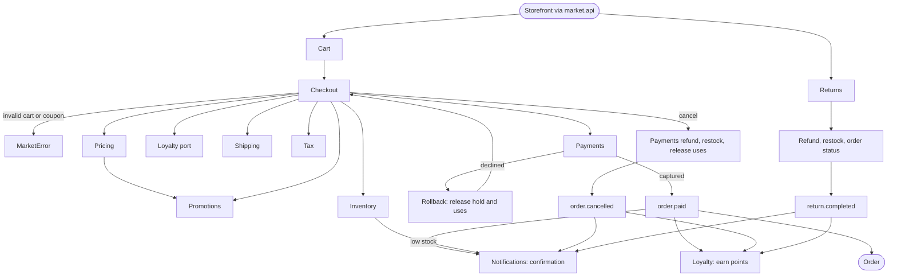

# End-to-end flow

The one overview of how the system runs, from trigger to result. Written by `/trd-create`; when the end-to-end flow changes, update this file: it is the single source of the overview, and other documents link here instead of drawing their own.

Placement sequence of `place_order` (CHK-02, CHK-06):

1. Load the open, unexpired, non-empty cart and the customer.
2. `build_quote`: price, then loyalty redemption through the port, then shipping, then tax (CHK-04).
3. `validate_checkout`: address, minimum, rejected coupons.
4. `inventory.reserve`.
5. `promotion_usage.hold_uses`.
6. Create the order as `pending` with the prices frozen.
7. `payments.charge`.
8. Captured: `inventory.commit`, `commit_uses`, status `paid`, cart `converted`, event `order.paid`. Failed: `_rollback` (release the hold and the uses), status `payment_failed`, cart stays open.

Legend: rounded nodes are external actors or systems; rectangles are features (`docs/trd/<feature>.md`); labeled edges are failure exits. Core never calls loyalty, returns or notifications: they react to events (`docs/trd/infra.md`), and checkout asks loyalty only through its port.
