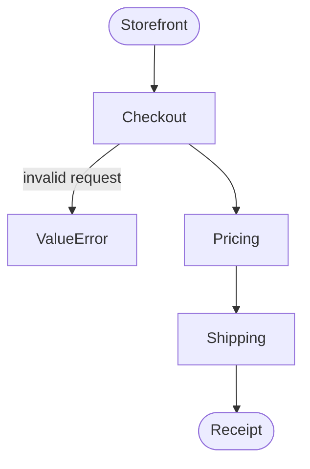

# End-to-end flow

The one overview of how the system runs, from trigger to result. Written by `/trd-create`; when the end-to-end flow changes, update this file: it is the single source of the overview, and other documents link here instead of drawing their own.

Legend: rounded nodes are external actors or systems; rectangles are features (`docs/trd/<feature>.md`); labeled edges are failure exits.
